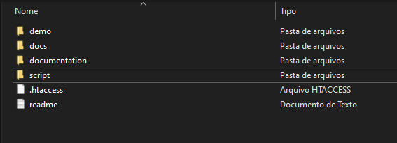
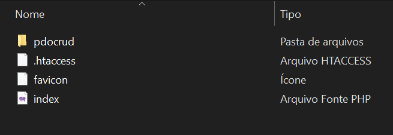

# B1Sistema-PDOCRUD

Sistema de visualização dos dados de compra dos clientes e gerenciamento de fase do processo

## **Importante**

Esse projeto depende umbilicalmente da biblioteca PDOCRUD, que não é open-source, tampouco de uso gratuito, então garanta ter uma distribuição dessa biblioteca antes de trabalhar nesse projeto.

Caso ela não esteja disponível na pasta ```public/pdocrud/``` então será necessário instalá-la.

Como essa dependência também é altamente personalizável, e diversas configurações precisam ser feitas para seu uso, uma versão já configurada estará disponível no link abaixo.

[Link para download](https://github.com/B1GabrielAugusto/PDOCRUD_distro/raw/main/PDOCRUD_configurado.zip)

Acesse esse link com login realizado no GitHub em uma conta com acesso ao repositório.

## Instalação do PDOCRUD

Ao ter a distribuição já configurada em mãos



Mova a pasta ```pdocrud``` para dentro da pasta ```public``` do projeto.



A partir deste momento a confuração do projeto estará completa.
