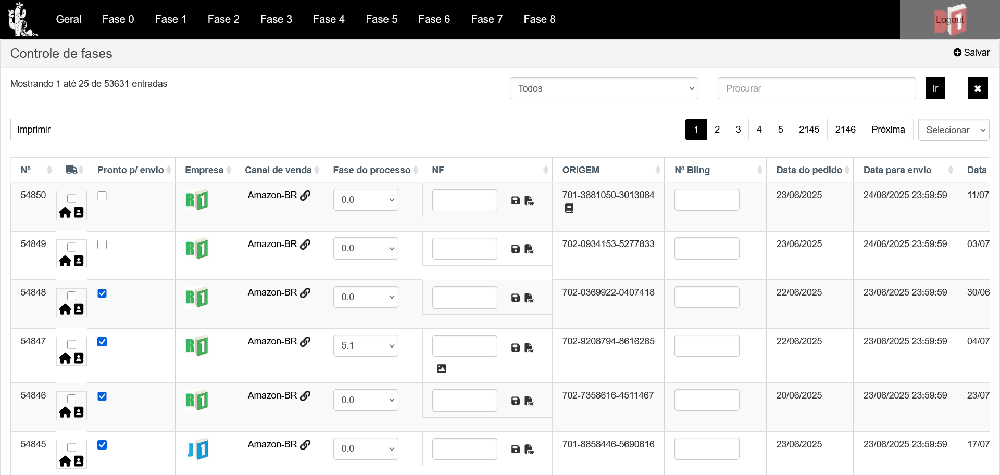
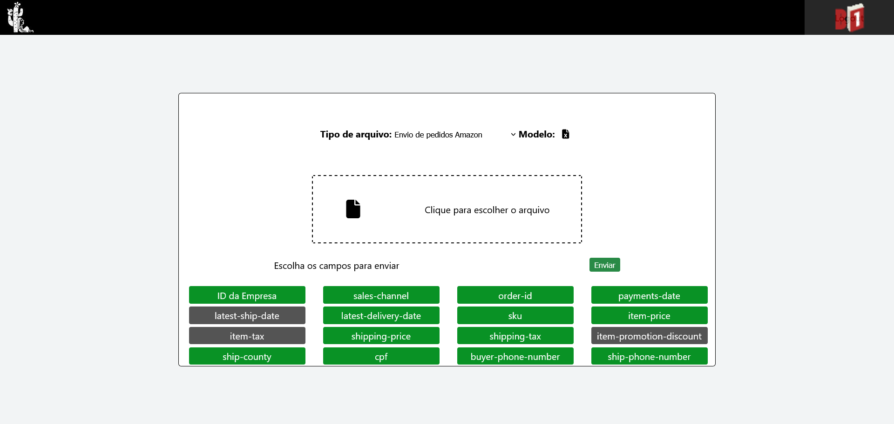
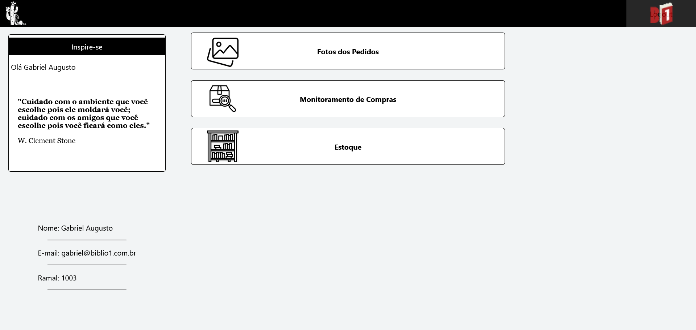
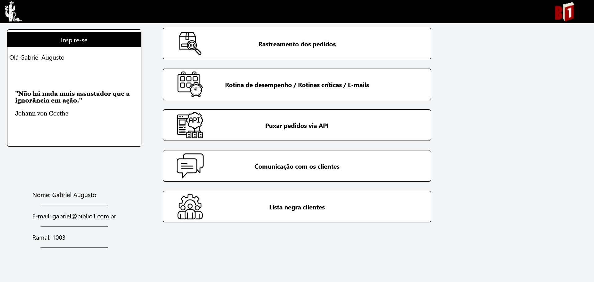
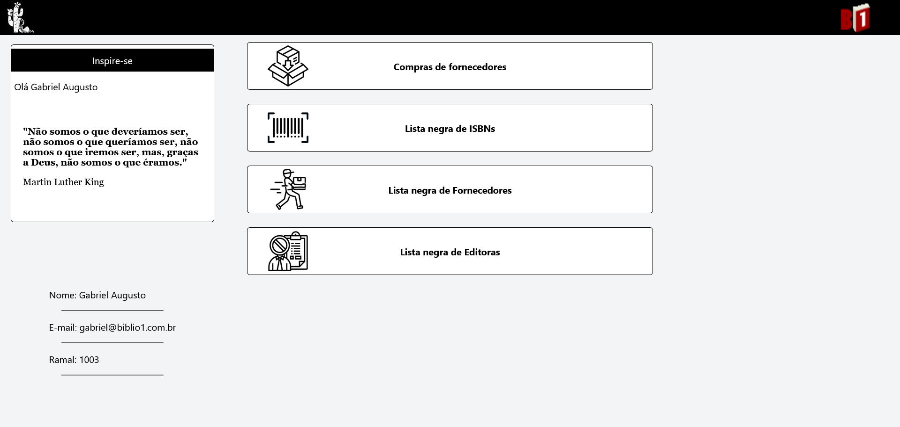
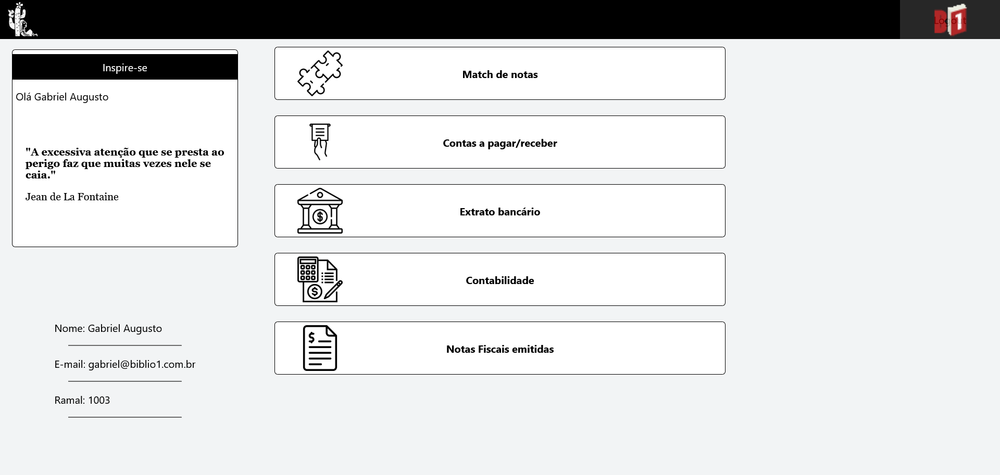

# B1Sistema-PDOCRUD

Sistema de visualização dos dados de compra dos clientes e gerenciamento de fase do processo

## **Importante**

Esse projeto depende umbilicalmente da biblioteca PDOCRUD, que não é open-source, tampouco de uso gratuito, então garanta ter uma distribuição dessa biblioteca antes de trabalhar nesse projeto.

## Funcionalidades

### Gerenciamento de pedidos

Tela principal do sistema. Uma tabela de edição direção direta, como uma planilha, onde todos os dados dos pedidos estão disponíveis para consulta e alteração. Permitindo alteração de fases para um melhor controle de etapa corrente do pedido

### Envio de planilhas

Os pedidos são inseridos via API para alguns canais de venda, mas para outros, o envio manual via planilha é feito. Esta tela também é útil para atualização massiva de dados do sistema.

### Expedição

Seção com funcionalidades específicas para o envio dos pedidos.

### Atendimento

Seção com funcionalidades específicas para o atendimento de clientes.

### Compras

Seção com funcionalidades específicas para a compra com fornecedores.

### Financeiro

Seção com funcionalidades específicas para controle das finanças das empresas.

